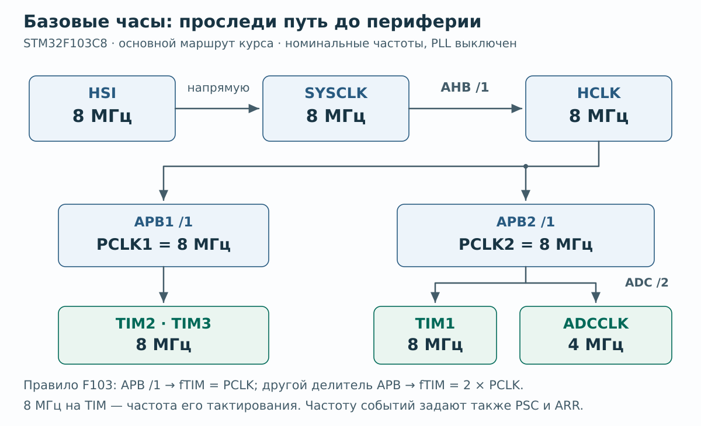

# CubeMX → CMake → VS Code: воспроизводимая настройка

Проверено по официальной документации **2026-10-09**. Номера установленного у вас ПО надо записать отдельно: этот текст не утверждает, что конкретный набор версий был установлен и испытан на физической Blue Pill.

## Сначала различите пять операций

| Операция | Что делает | Признак успеха |
|---|---|---|
| Generate | CubeMX создаёт инициализацию из `.ioc` | Обновились исходники и файлы сборки |
| Configure | CMake выбирает компилятор, файлы и каталог сборки | Появился build-каталог без ошибок configure |
| Build | GCC компилирует, linker размещает код и данные | Свежий `.elf`, успешный exit code |
| Flash + verify | Программатор записывает образ в МК и сравнивает | Успешное сообщение записи **и** проверки |
| Debug | GDB через debug server управляет ядром | Остановка в `main`, корректные символы и переменные |

Успех Generate не означает успех Build. Успех Build не доказывает ни запись, ни работу схемы. Кнопка Debug иногда автоматически выполняет несколько этапов, но при неисправности их надо проверять по отдельности.

## A. Основной маршрут: инструменты под управлением ST

### A1. Сначала проверить имеющееся, затем установить недостающее

Не начинайте с переустановки. В CubeMX откройте сведения о версии и пакетах; в VS Code — карточку установленного ST-расширения и выбранный tool bundle. Сохраните номера в [паспорте](#passport). Если существующая среда уже собирает проект для точного МК, используйте её. «Установлено» и «выбрано текущим проектом» — разные факты.

Минимальный набор для нового стенда:

1. [STM32CubeMX с поддержкой STM32F1](https://www.st.com/en/development-tools/stm32cubemx.html). Для F1 используется исходный **CubeMX / HAL1**, не CubeMX2 / HAL2. В менеджере встроенного ПО нужен **STM32CubeF1**. [Поддерживаемые семейства](SOURCES.md#s6).
2. [VS Code](https://code.visualstudio.com/) и официальный пакет [STM32CubeIDE for Visual Studio Code](https://marketplace.visualstudio.com/items?itemName=stmicroelectronics.stm32-vscode-extension), издатель STMicroelectronics, ID `stmicroelectronics.stm32-vscode-extension`.
3. Разрешить пакету установить предусмотренные его версией зависимости и инструменты. Выбрать **GCC**, чтобы генератор и сборка использовали одну инструментальную цепочку.
4. Установить необходимые USB-драйверы пробника по [официальной инструкции ST](SOURCES.md#s7). На Windows для ST-LINK/V2/V2-1 используется [STSW-LINK009](https://www.st.com/en/development-tools/stsw-link009.html); не заменяйте драйвер случайным пакетом из видео.
5. Для пошагового маршрута курса нужен **[STM32CubeProgrammer с GUI](https://www.st.com/en/development-tools/stm32cubeprog.html)**: установите его отдельно или используйте уже имеющуюся установку. В L00 через его окно проверяем связь, записываем Flash и выполняем verify; отладчик запускаем из VS Code. Это состав именно данного учебного маршрута, а не требование ко всем рабочим процессам ST в VS Code.

В нынешней архитектуре расширения bundle manager поставляет необходимые CLI-инструменты. Документация миграции называет её «3.x and newer» и прямо снимает необходимость отдельного CubeCLT. Не устанавливайте одновременно старую конфигурацию 2.x, новый пакет и несколько конкурирующих debug-расширений только «на всякий случай». [ST: migration](SOURCES.md#s8), [ST: release note](SOURCES.md#s22).

**Состав цепочки, который должен получиться:** CMake; выбранный генератор сборки, обычно Ninja; Arm GCC и binutils; GDB; ST-LINK GDB server/средства ST для выбранного пробника; данные устройства и файлы STM32CubeF1/CMSIS/HAL. VS Code является оболочкой, а не заменой компилятора или аппаратного пробника.

### A2. Создать проект в CubeMX

- `New Project → MCU Selector`: точная маркировка, для базового стенда `STM32F103C8T6`.
- Не выбирайте похожую Nucleo/Discovery-плату: это добавит чужие выводы и аппаратные предположения.
- Настройте [базовую конфигурацию L00](labs/00-bringup.md#cubemx).
- В `Project Manager → Project` задайте имя без пробелов, например `bluepill_bringup`, и понятную папку.
- `Toolchain/IDE: CMake`; если есть `Default Compiler/Linker`, выберите `GCC`.
- В `Code Generator` включите сохранение пользовательского кода при регенерации (`Keep User Code when re-generating`). Сохраните `.ioc`, затем `Generate Code`.

Поддержка CMake и альтернативного Makefile проверена в **UM1718 Rev 51, §4.11**. На момент проверки официальный онлайн-портал CubeMX перенаправлялся на документацию **6.18.1**; это наблюдение о документации, а не требование установить именно эту версию. [UM1718](SOURCES.md#s5).

Если пункта CMake нет, сначала проверьте версию CubeMX и выбранный продукт. Сохраните копию `.ioc` перед обновлением. Если обновлять среду нельзя, воспользуйтесь отдельным маршрутом B, а не переименовывайте Makefile в CMakeLists.

### A3. Открыть и собрать в VS Code

1. `File → Open Folder`: папка, содержащая `.ioc` и верхний `CMakeLists.txt`.
2. Выберите configure preset `Debug`, если именно он присутствует в проекте.
3. В представлении ST выполните `Discover STM32Cube project`, если проект не обнаружился автоматически. Проверьте устройство, GCC и выбранный проект.
4. Дождитесь configure, затем выполните `CMake: Build` или соответствующую кнопку Build текущей версии расширения.
5. В логе найдите реальный путь к созданному `.elf`. Проверьте время файла и отсутствие ошибок. Не считайте красные подчёркивания редактора или их отсутствие результатом компиляции.
6. Один раз включите подробный build-лог. Для обычного GCC-проекта F103 ожидаются Arm GCC и параметры Cortex-M3/Thumb (обычно `-mcpu=cortex-m3`, `-mthumb`); у link — linker script именно вашего МК. Если видите обычный desktop `gcc`, вернитесь к выбранному toolchain. Если файлы уже актуальны и компиляции в логе нет, после небольшого изменения L00 соберите снова. Успешное `ninja: no work to do` само по себе не ошибка, но не показывает новую компиляцию.

**Выход из настройки:** одна строка в журнале «проект → preset → полный путь `.elf` → действие Build». Её должно хватать, чтобы повторить сборку завтра. Для отдельной проверки объявленной цели и памяти есть необязательный [read-only checker](#target-check); он не нужен, чтобы начать лабораторию.

Этот порядок соответствует [ST: First project creation → Import STM32CubeMX project / Open in VS Code](SOURCES.md#s10). Точные имена отдельных кнопок могут меняться; определяйте этап по логу и файлам проекта.

### A4. Сначала проверить связь, затем записать

При отключённом питании соедините SWD по [SAFETY](SAFETY.md), подайте питание одним способом. В CubeProgrammer выберите ST-LINK, SWD, небольшую поддерживаемую частоту и Connect. Сохраните модель/ID, напряжение, размер Flash и сведения о пробнике. Идентификатор устройства помогает диагностике, но сам по себе не доказывает подлинность кристалла.

Откройте **свежий** `.elf`/`.hex`, запишите с проверкой и выполните reset/run. Если выбран сырой `.bin`, адрес записи для стандартного проекта курса — `0x08000000`; у `.elf` и `.hex` адреса уже заданы в файле. Не переносите этот адрес на проекты с отдельно установленным пользовательским bootloader без анализа их карты памяти.

Для CLI ниже используется имя `STM32_Programmer_CLI`; на Windows исполняемый файл заканчивается на `.exe`, на другой системе путь/launcher берите из установленного пакета. Пример заменяет прошивку подключённой учебной платы:

```sh
STM32_Programmer_CLI -c port=SWD freq=400 -w "build/Debug/bluepill_bringup.elf" -v -rst
```

Путь к `.elf` замените на **путь из своего build-лога**. Опция `-v` должна идти сразу после операции записи. Если подключено несколько пробников, сначала выберите конкретный по серийному номеру. Перед запуском остановите debug-сессию: два приложения не должны одновременно владеть пробником. [ST: MCU command lines](SOURCES.md#s13).

### A5. Запустить отладку

После успешного build откройте `Run and Debug`, выберите ST-LINK. Современный пакет ST умеет создать начальную конфигурацию; используйте её, затем при необходимости сохраните `launch.json` штатной командой. Убедитесь, что загружается тот же `.elf`, который только что собран. Первый ориентир — остановка в `main`.

Не вставляйте `launch.json` от Cortex-Debug в конфигурацию собственного debug adapter ST: у них разные типы и поля. Отдельный **OpenOCD для основного ST-маршрута не требуется**. Подробнее о проверке результатов: [DEBUGGING](DEBUGGING.md). [ST: Debug](SOURCES.md#s11).

## B. Независимая сборка или существующая среда CubeCLT

Это альтернатива, а не список дополнительных обязательных установок к маршруту A.

| Компонент | Что проверять |
|---|---|
| Arm GNU Toolchain или GNU Tools for STM32 | Цель `arm-none-eabi`; Cortex-M3, Thumb; не desktop GCC и не `arm-linux-gnueabihf` |
| CMake | Версия не ниже `cmake_minimum_required` и требований схемы `CMakePresets.json` проекта |
| Ninja | Нужен, если preset выбрал генератор Ninja |
| GNU Make | Нужен только для проекта Makefile или соответствующего CMake-генератора |
| GDB для Arm | Для отладки; обычный debugger x86 не подойдёт |
| STM32CubeProgrammer либо OpenOCD | Для записи; debug server нужен только при отладке |
| Драйверы/права USB | Отдельный слой; установленный GCC их не исправляет |

[CubeCLT](https://www.st.com/en/development-tools/stm32cubeclt.html) остаётся официальным набором CLI-инструментов. Он удобен для существующей среды или самостоятельной цепочки, но не обязателен рядом с новым ST-пакетом VS Code. Состав и каталоги конкретного релиза сверяйте с его документацией; не копируйте чужой абсолютный путь. [Источник](SOURCES.md#s12).

В терминале, где доступны выбранные инструменты, проверьте:

```sh
arm-none-eabi-gcc --version
arm-none-eabi-gdb --version
cmake --version
ninja --version
```

Для CMake-проекта сначала посмотрите реальные presets:

```sh
cmake --list-presets
cmake --list-presets=build
```

Если проект содержит configure preset `Debug` и build preset `Debug`:

```sh
cmake --preset Debug
cmake --build --preset Debug --parallel
```

Если build preset отсутствует, соберите через фактический `binaryDir` configure preset, например:

```sh
cmake --preset Debug
cmake --build build/Debug --parallel
```

Последний путь — пример. Если configure требует инструментов, которые расширение добавляет в своё окружение, запускайте его из подготовленного окружения ST или настройте пути явно. Доступность команды в терминале вне VS Code и внутри него может различаться. [CMake presets](SOURCES.md#s16).

### Если выбран Makefile

В **отдельной копии проекта** выберите в CubeMX `Toolchain/IDE: Makefile`. Нужны Arm GCC/binutils и GNU Make. Из папки с сгенерированным Makefile:

```sh
make -j4
```

Если Makefile поддерживает `GCC_PATH`, можно передать путь к `bin` вашего toolchain; сначала прочитайте его секцию настройки. Не изменяйте generated Makefile без сохранения своего diff: регенерация может его заменить. Flash выполняется отдельно тем же CubeProgrammer. Полноценную debug-конфигурацию при этом настраивают отдельно; CMake-only функции расширения не обещаются для Makefile-проекта.

### OpenOCD: необязательная ветка для знакомой среды

Нужны OpenOCD, его комплект `scripts`, поддерживаемый SWD-пробник и права USB. Сначала проверьте `openocd --version` и наличие `interface/stlink.cfg` / `target/stm32f1x.cfg` **в установленной версии**. В разных выпусках ST-LINK-драйвер использует HLA или прямой DAP API, поэтому не добавляйте `transport select hla_swd` из случайной инструкции.

Пример программирования стандартной цели без пользовательского bootloader **для установки, где штатный `interface/stlink.cfg` использует `adapter driver hla`** (так устроен официальный комплект OpenOCD 0.12.0):

```sh
openocd -f interface/stlink.cfg -c "transport select hla_swd" -f target/stm32f1x.cfg -c "adapter speed 400" -c "program build/Debug/bluepill_bringup.elf verify reset exit"
```

Если ваш интерфейсный скрипт использует прямой драйвер `st-link`, выберите SWD-транспорт по его документации: в разных поколениях встречаются `dapdirect_swd` и `swd`. Не применяйте HLA-команду к нему и не смешивайте executable одной версии со скриптами другой. Это условный пример существующей среды, не рекомендация устанавливать старый релиз. При несовместимости используйте документированный вариант, а не подменяйте ID МК. Отладка через OpenOCD дополнительно требует совместимого VS Code debug adapter и `arm-none-eabi-gdb`; это другая конфигурация, чем ST GDB server. Не запускайте их одновременно. [OpenOCD: adapter configuration](SOURCES.md#s15), [flash programming](SOURCES.md#s14).

## Windows, Linux и macOS

- **Windows:** начните с native VS Code и native ST-инструментов. Установите официальный драйвер пробника. `where.exe arm-none-eabi-gcc` показывает, какой компилятор найден. В PowerShell путь к программе с пробелами запускается через `& "C:\...\program.exe"`. После изменения PATH откройте новый терминал. Избегайте смешивания WSL-компилятора, Windows-путей и USB-проброса на первом занятии.
- **Linux:** используйте поддерживаемые ST инструкции по USB/udev для своего пакета. Отсутствие прав на USB не лечится изменением linker script. Не делайте постоянный запуск всего редактора от root стандартным решением.
- **macOS:** выбирайте пакет под архитектуру Mac; не угадывайте путь по примеру для Windows. Если ОС блокирует установку или драйвер, следуйте официальному установщику, не отключайте системную защиту ради случайного бинарника.
- На всех ОС храните первую рабочую копию в коротком локальном пути, например `stm32/bluepill_bringup`. Это снижает число переменных при диагностике. Проверенный список поддерживаемых ОС находится в [ST: System requirements](SOURCES.md#s7).

<a id="host-tests"></a>
## Отдельно: тесты на компьютере, без платы

Для L00 этот набор не нужен. Он потребуется для C-упражнений и проверки CSV дальше по курсу. **`arm-none-eabi-gcc` создаёт код для МК; host-тестам нужен обычный GCC или Clang, создающий программу для вашего компьютера.** CMake/Ninja из ST-пакета не заменяют этот компилятор, Bash или GNU Make.

| Задача | Минимальные инструменты |
|---|---|
| `tests/run_digital_tests.sh` | Bash и native GCC/Clang с C11 |
| `examples/host-buffering` / L10 | GNU Make и native GCC/Clang с C11; Python для release-check |
| CSV checker и Python-тесты | Python **3.10 или новее**, стандартная библиотека |
| Пересборка страниц курса | Python 3.10+; Node.js нужен только для тестов JavaScript, выполняемых сопровождающим сайта |

Если подходящие инструменты уже есть, используйте их. Установка ещё одной среды не требуется. Проверяйте команды в **том терминале, где будете запускать тесты**:

```sh
bash --version
gcc --version
make --version
python3 -c "import sys; assert sys.version_info >= (3, 10); print(sys.version)"
```

При использовании Clang замените проверку `gcc` на `clang --version`, а в тестах задайте `CC=clang`.

### Windows x64: вариант без WSL

Один конкретный путь — официальный **MSYS2 UCRT64**. Если вы выбираете установку: следуйте [MSYS2 Getting Started и Update guide](SOURCES.md#s23), затем откройте именно **MSYS2 UCRT64**, а не PowerShell и не обычный MSYS-терминал. Bash входит в MSYS2; недостающие пакеты можно установить так:

```sh
pacman -S --needed mingw-w64-ucrt-x86_64-gcc make mingw-w64-ucrt-x86_64-python
```

В этом же UCRT64-терминале перейдите в корень курса, например `cd /c/stm32/STM_learning`, выполните проверки выше и запускайте команды лабораторий. Не меняйте ради host-тестов toolchain firmware-проекта в VS Code. Для Windows ARM64 выбирается другое окружение по официальной таблице MSYS2; x64-команда выше не является универсальной для всех архитектур.

Первый baseline без зависимости от поддержки sanitizers:

```sh
SANITIZE=0 CC=gcc bash tests/run_digital_tests.sh
make -C examples/host-buffering release-check CC=gcc
python3 -m unittest discover -s tests -p test_capture_checker.py
```

`SANITIZE=0` означает «дополнительный sanitizer-прогон пропущен», а не «он пройден». `release-check` проверяет исходный учебный комплект с ожидаемо неготовым `student.c`; после своей реализации используйте `make -C examples/host-buffering exercise-check CC=gcc`. Подробности — в [README упражнения L10](../examples/host-buffering/README.md). PowerShell сам по себе не выполняет Bash-скрипт; наличие Git Bash также не подтверждает наличие C-компилятора.

### Linux и macOS

- **Ubuntu/Debian-подобная среда:** используйте имеющиеся Bash, GCC/Clang, GNU Make и Python. Если выбрана установка из системного репозитория, для Ubuntu подходят `build-essential` и `python3`; проверьте версию Python. [Официальные пакеты Ubuntu](SOURCES.md#s24).
- **macOS:** Command Line Tools for Xcode предоставляют Clang и build-инструменты; при отсутствии их можно установить штатно через `xcode-select --install`. Проверьте `make --version` и Bash. Python проверяется отдельно: не считайте старую системную копию достаточно новой и не удаляйте её; при необходимости используйте официальный Python installer. Для C-тестов задайте `CC=clang`. [Apple и Python](SOURCES.md#s25).

Чтение готового offline-сайта не требует Node.js. Если вы сопровождаете сайт и запускаете его JavaScript-тесты, подойдёт актуальный поддерживаемый LTS с [официальной страницы Node.js](SOURCES.md#s26); проверьте `node --version` и следуйте командам сайта.

Эти OS-маршруты сверены с документацией поставщиков. Выполнение тестов курса в подготовке проверялось на Linux; Windows/MSYS2 и macOS здесь не запускались. Host-test PASS не доказывает работу STM32-прошивки или электрической схемы.

<a id="code-ownership"></a>
## Кто владеет каким кодом

| Изменение | Где делать | Что проверить после Generate |
|---|---|---|
| Пин, тактирование, IRQ, параметры периферии | `.ioc` в CubeMX | Diff и согласованный generated init |
| Несколько строк логики L00 | Существующие `USER CODE BEGIN/END` | Строки сохранились на своих местах |
| Свой модуль `.c/.h` | Отдельные файлы; добавить `.c` в пользовательскую часть build-конфигурации | Файл действительно компилируется, символ есть в link/map |
| `SystemClock_Config`, `MX_GPIO_Init`, MSP init | Обычно генерирует CubeMX | Не исправлять постоянную ошибку `.ioc` временной правкой generated тела |
| HAL/CMSIS/startup | Версия пакета ST | Не менять библиотеку ради обхода ошибки настройки |
| Локальный путь toolchain/debug | Пользовательские настройки текущей машины | Не переносить чужой абсолютный путь |

`Keep User Code` сохраняет предусмотренные секции, а не произвольные изменения всего дерева. Не переносите и не переименовывайте маркеры; не создавайте ещё один `main`. Для новых файлов читайте комментарии конкретного верхнего `CMakeLists.txt`: место пользовательского списка файлов может отличаться между версиями генератора. [Граница генерации ST](SOURCES.md#s5).

Быстрая страховка L00: сохраните рабочую копию → Generate без изменения `.ioc` → просмотрите diff → Build. Три пользовательские строки должны остаться, а поведение не измениться. Это проверка владения кодом, а не ещё одна лаборатория. Успешный Git diff не заменяет build.

## Что сохранять в Git

Сохраняйте `.ioc`, пользовательские исходники, настройки сборки, linker script, startup и необходимые HAL/CMSIS-файлы либо документированный способ получить **точно тот же** пакет. Сохраните версии и существенные настройки. Не включайте бинарные build-каталоги, локальные абсолютные пути и `CMakeUserPresets.json` с машинно-зависимой конфигурацией.

Пользовательский код помещайте в `USER CODE BEGIN/END` или отдельные `.c/.h`, которые явно добавлены в сборку. После регенерации просматривайте diff и снова собирайте. Само наличие файла в дереве VS Code не означает, что linker его использовал.

<a id="passport"></a>
## Паспорт рабочего проекта

Это одна заметка или снимок экрана, не отдельный отчёт. Первую часть заполните **до установки**, вторую — из первого успешного цикла. Не угадывайте версии по старому руководству.

```text
ДО СТАРТА
Дата, ОС и архитектура:
Маркировка МК / плата / проверенная схема:
Программатор / версия его firmware:
Питание и измеренное напряжение:
CubeMX:
STM32CubeF1:
VS Code / пакет ST:
Выбранный bundle ST / GCC / CMake / генератор сборки:

ПОСЛЕ ПЕРВОГО УСПЕХА
Путь .ioc / configure preset / полный путь .elf:
Flash и SRAM в linker script:
L00: источник HSI; SYSCLK/HCLK/PCLK1/PCLK2 = 8 МГц:
Команда либо действие Build:
Команда либо действие Flash + verify:
Breakpoint и наблюдаемая переменная:
Результат после RESET без активного debugger:
```

Для C8 ожидается `FLASH ... LENGTH = 64K` и `RAM ... LENGTH = 20K`; для подтверждённого CB Flash 128K. Если build переполняет 64K, сначала исследуйте размер и состав прошивки. Изменение числа на 128K не является исправлением для C8.

Номера берите из About/карточки пакета и **реального build-лога**. При смене tool bundle, CubeMX или STM32CubeF1 сохраните предыдущую рабочую версию проекта и повторите L00; «latest» не фиксирует среду. Позже допишите частоты таймеров и ADC, когда включите эту периферию.

<a id="target-check"></a>
## Необязательно: проверить файлы цели без платы

[Checker и примеры запуска](../tools/README-project-check.md) используют Python 3.10+ и только читают указанные файлы. Они не запускают сборку, прошивку, сетевые запросы или код из проекта. Можно сверить точную модель в `.ioc`, явно заданные области `FLASH`/`RAM` linker script и, если есть `.elf`, его заголовок ARM и размещение загрузочных сегментов/начальных векторов.

Это дополнительный фильтр против чужого проекта, 128K для C8 или desktop ELF. Он **не устанавливает**, что переданный linker script действительно участвовал в сборке, что ELF соответствует текущим исходникам, что инструкции подходят Cortex-M3 или что на плате стоит оригинальный STM32. Такие факты проверяются build-логом и аппаратным результатом. Неподдерживаемый формат требует ручного просмотра, а не подгонки проекта под checker. Без `.elf` этап проверки образа помечается `NOT RUN`.

<a id="clocks"></a>
## Общий договор о частотах

Все основные лаборатории используют левый столбец. Не переносите числа PSC/ARR из правого столбца без пересчёта.

| Узел | Основной стенд: HSI | Факультатив: проверенный HSE 8 МГц |
|---|---:|---:|
| Источник | Внутренний HSI, номинально 8 МГц | Реальный внешний кварц 8 МГц |
| PLL | Выключен | HSE /1 ×9 |
| SYSCLK | 8 МГц | 72 МГц |
| AHB / HCLK | /1 → 8 МГц | /1 → 72 МГц |
| APB1 / PCLK1 | /1 → 8 МГц | /2 → 36 МГц |
| TIM2, TIM3 | 8 МГц | 72 МГц |
| APB2 / PCLK2 | /1 → 8 МГц | /1 → 72 МГц |
| TIM1 | 8 МГц | 72 МГц |
| ADC divider / ADCCLK | /2 → 4 МГц | /6 → 12 МГц |
| Flash latency при питании стенда 3,3 В | 0 wait states | 2 wait states |



Основной HSI-стенд из левого столбца: проследи источник частоты перед подстановкой PSC/ARR. Это номинальное дерево тактирования, а не независимое измерение точности HSI.

[Открыть схему отдельно для увеличения](assets/diagrams/hsi-baseline-clock-tree.svg).

Для F103 частота таймера равна PCLK соответствующей шины при делителе APB `/1`; при другом делителе — `2 × PCLK`. Поэтому PCLK1=36 МГц не означает TIM2=36 МГц. В edge-aligned счёте вверх: `f_update = f_TIM / ((PSC + 1) × (ARR + 1))`. Формула относится к непрерывному edge-aligned счёту вверх при ARR≥1 и разрешённых update events; для TIM1 предполагается RCR=0. ARR=0 блокирует счётчик и не даёт расчётную частоту по этой формуле. Это расчёт частоты событий таймера, а не автоматическое обещание такой же частоты toggle в callback. [RM0008, §7.2 и главы таймеров](SOURCES.md#s2).

Для перехода на правый столбец сначала подтвердите тип и частоту внешнего источника схемой/маркировкой. Режим `Crystal/Ceramic Resonator` нужен для кварца; `Bypass Clock Source` — для уже сформированного внешнего тактового сигнала. Не путайте кварц HSE с часовым LSE 32,768 кГц. Сохраните рабочую HSI-версию, дайте CubeMX сгенерировать согласованный `SystemClock_Config`, затем проверьте возвраты HAL, PLL ready, `SystemCoreClock` и независимое временное наблюдение.

Изменение одного числа `HSE_VALUE` не меняет физический кварц. HSI в F103 приходит на PLL через `/2`, поэтому HSI-путь не даёт законные 72 МГц. Вся база курса работает без HSE, USB и LSE. [RM0008, §§7.2.1–7.2.3](SOURCES.md#s2).

HSI выбран для простого старта без зависимости от качества кварца, а не для эталонной метрологии. У него есть погрешность и зависимость от условий. В UART складываются ошибки генераторов обеих сторон и округления делителя. Начните с короткого соединения и умеренной скорости; для точных измерений или устойчивой связи в широком диапазоне условий нужен отдельный анализ тактирования. Захват собственных импульсов той же платой проверяет логику и отношение частот, но не абсолютную точность HSI.

### Необязательно: сверить собственный расчёт таймера

[Открыть офлайн-практику PSC/ARR](../practice/timer/index.html): выберите один из двух профилей выше, сами задайте регистры и сначала запишите прогноз частот. Затем помощник покажет номинальную арифметику и границы модели; ARR=0 отдельно означает блокированный счётчик. Ссылки в помощнике возвращают к этому договору и L05.

Этот шаг можно пропустить: обязательное время курса, оборудование и критерии зачёта не меняются. Ответы не сохраняются и прогресс не отмечается. Помощник не проверяет реальную конфигурацию или сигнал платы; для задания «по памяти» закройте его. Для офлайн-переходов распакуйте и сохраните всю папку курса.

