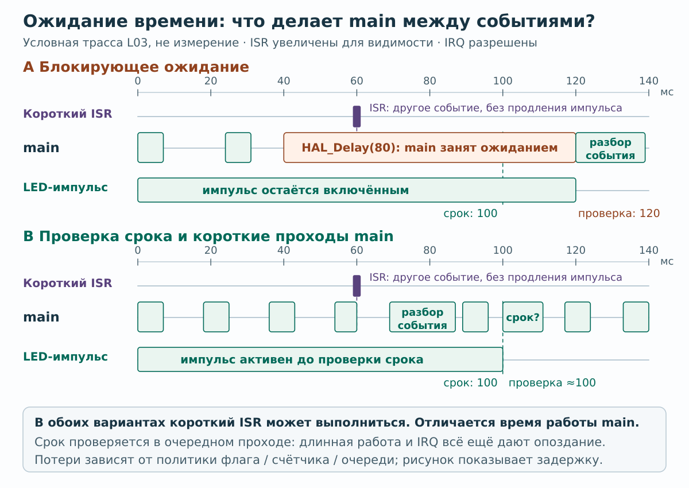

# L03. Время без delay: rollover, периодические задачи и состояния

Предпосылка: L02. Результат: кнопка, LED и будущий UART обслуживаются независимо, а переход счётчика миллисекунд через ноль не ломает приложение. Аналог `millis()` знаком по Arduino; здесь нужно уметь доказать свойства кода, а не просто заменить имя функции.

## Миссия: индикатор занят, интерфейс остаётся отзывчивым

Оператор нажимает кнопку, пока стенд показывает импульс и готовит периодический отчёт. Ему не должно приходиться ждать конца мигания. Твоя задача — выбрать поведение при опоздании и показать, какое прошлое программа уже не может восстановить.

Время лабораторной остаётся 3 часа. Если unsigned-время знакомо, начни с частично заполненной трассы и задачи переноса; готовый каркас используй для сравнения. Честно отделяй «функция логически верна» от «main успевает её вызвать».

## Аппаратная часть

Схема и CubeMX остаются из L02: HSI 8 MHz, SysTick, PB12 input/EXTI, выбранный PC13/PB0 LED, SWD. Сохрани его `APP_LED_*` определения из L01. Новых периферий нет. Это работа про программное время, не про настройку аппаратного TIM.

HAL использует tick для своих timeout-функций; в типовом проекте он обновляется из SysTick. Не удаляй `HAL_IncTick()` из сгенерированного пути. Остановка tick влияет и на собственные интервалы, и на HAL timeout. [Официальная реализация HAL timebase](https://github.com/STMicroelectronics/stm32f1xx-hal-driver/blob/master/Src/stm32f1xx_hal.c).

## Опыт 1. Почему нельзя сравнивать now с last + period

Счётчик `uint32_t` в миллисекундах переходит через ноль примерно каждые 49,7 суток. Не надо ждать столько на плате: чистой функции передаются искусственные значения.

```c
/* Условие зависит от переполнения суммы и не подходит как общий шаблон. */
if (now >= last + interval) { /* ... */ }

/* Прошедшее время по модулю 2^32. */
if ((uint32_t)(now - last) >= interval) { /* ... */ }
```

Например, `last = UINT32_MAX - 9`, `now = 10`: прошло 20 ms. Беззнаковое вычитание даёт нужный результат. Это не магия для произвольно длинных пауз: по одной 32-битной отметке нельзя узнать число полных оборотов. Наш контракт: интервалы меньше `2^31` ms, обслуживание происходит существенно чаще одного полного оборота. Если сравниваешь **дедлайны** «раньше/позже», расстояние между сравниваемыми временами дополнительно должно быть меньше половины диапазона.

Helper `digital_deadline_reached` использует только unsigned-арифметику; не полагайся без объяснения на преобразование огромного unsigned к signed. Это отдельная функция от проверки прошедшего интервала.

В Bash из **корня распакованного курса** (папка с `tests/`, не CubeMX-проект) запусти `bash tests/run_digital_tests.sh`, затем добавь свой тест: начало `0xFFFFFFF0`, через 32 ms значение `0x10`, период 25 ms. Тест должен пройти при любой реальной длительности запуска на компьютере. Подготовка Bash и native GCC/Clang, включая Windows baseline `SANITIZE=0`, описана в [host-инструкции](../TOOLCHAIN.md#host-tests); Arm GCC здесь не используется.

## Опыт 2. Выбери политику опоздания

Есть три разных требования:

- `last = now`: выполнить один раз, отсчитать следующий интервал от фактического запуска; возможен накопленный сдвиг фазы
- `last += period`: удерживать исходную сетку; при большом отставании наивный цикл может надолго занять CPU
- `last += due * period`: сохранить сетку, обработать текущее состояние один раз, отдельно посчитать пропущенные слоты

Для LED и опросной кнопки выбираем третий вариант. Для дискретизации ADC позже задачу запускает TIM, а не попытка программно «догнать» пропущенные измерения. Несколько вызовов `ReadPin` подряд не возвращают прошлое состояние входа.

## Восстанови решение на временной трассе

**Разобранный пример:** anchor=0, period=20 ms, main вернулся в now=95. Наступили четыре слота: 20, 40, 60, 80. `digital_periods_due` возвращает 4 и сдвигает anchor в 80. Кнопку читаем один раз сейчас; три прошлых опроса отмечаем пропущенными. До следующего слота остаётся 5 ms.

**Твоя часть:** anchor=`0xFFFFFFF0`, now=`0x10`, period=25 ms. До запуска заполни четыре числа: elapsed, due, новый anchor, время до следующего слота. Затем проверь host-тестом. Если выполнить `ReadPin` несколько раз подряд, какое из этих чисел станет измерением прошлого входа? Объясни ответ.

<details>
<summary>Подсказка 1: раздели количество запусков и остаток времени</summary>

Unsigned-разность даёт прошедший интервал. Целая часть деления на период задаёт due, остаток — опоздание относительно последнего слота. Не присваивай anchor значение now, если хочешь сохранить исходную сетку.

</details>

<details>
<summary>Подсказка 2: проверяемый ответ</summary>

Прошло 32 ms; due=1; anchor=`0x09`; остаток 7 ms; следующий слот через 18 ms, в `0x22`. Несколько чтений в now не возвращают состояние ножки в пропущенный момент. Следующий вариант для самостоятельной проверки: тот же исходный anchor, now=`0x42`, period=25 ms.

</details>

## Каркас трёх задач

В `PV` из L02 оставь `button`, `sample_anchor`, `press_count`, `sample_missed`. Удали прежнее переключение LED на нажатии и прежнюю переменную `led_on`, чтобы у LED был **один владелец**. Добавь:

```c
typedef enum { INDICATOR_IDLE, INDICATOR_PULSE } indicator_state_t;
static indicator_state_t indicator;
static uint32_t pulse_started;
static uint32_t report_anchor;
static uint32_t last_loop;
volatile uint32_t report_windows;
volatile uint32_t max_loop_gap_ms;
```

В `USER CODE BEGIN 2` после прежней инициализации:

```c
indicator = INDICATOR_IDLE;
report_anchor = HAL_GetTick();
last_loop = report_anchor;
HAL_GPIO_WritePin(APP_LED_PORT, APP_LED_PIN, APP_LED_OFF);
```

Замени тело `USER CODE BEGIN 3` целиком:

```c
uint32_t now = HAL_GetTick();
uint32_t loop_gap = (uint32_t)(now - last_loop);
last_loop = now;
if (loop_gap > max_loop_gap_ms) max_loop_gap_ms = loop_gap;

/* Диагностика EXTI из L02, если оставлена. */
edges_observed += take_edges();

uint32_t due = digital_periods_due(now, &sample_anchor, 1u);
if (due != 0u) {
    if (due > 1u) sample_missed += due - 1u;
    bool pressed = HAL_GPIO_ReadPin(GPIOB, GPIO_PIN_12) == GPIO_PIN_RESET;
    digital_button_event_t event =
        digital_debounce_update(&button, pressed, now, 20u);
    if (event == DIGITAL_BUTTON_PRESSED) {
        ++press_count;
        indicator = INDICATOR_PULSE;
        pulse_started = now; /* повторное нажатие продлевает импульс */
    }
}

if (indicator == INDICATOR_PULSE &&
    digital_elapsed(now, pulse_started, 100u)) {
    indicator = INDICATOR_IDLE;
}
HAL_GPIO_WritePin(APP_LED_PORT, APP_LED_PIN,
    indicator == INDICATOR_PULSE ? APP_LED_ON : APP_LED_OFF);

if (digital_periods_due(now, &report_anchor, 1000u) != 0u) {
    ++report_windows; /* Пока наблюдаем в debugger, в L04 добавим UART. */
}
```

При отсутствии EXTI-этапа L02 убери только строку `edges_observed += take_edges();`. `sample_missed` и `max_loop_gap_ms` — диагностика, не требования «любой ценой быть нулём»: IRQ и тяжёлый код могут давать реальные опоздания. Разрешение `HAL_GetTick` около 1 ms не позволяет этим счётчиком измерить, например, 12 µs.

## Опыт 3. Осознанное нарушение времени

На один запуск добавь в ветку секундного отчёта `HAL_Delay(80u);`. Нажимай кнопку вокруг этого момента.

Предскажи заранее:

- Будет ли 100 ms LED-импульс всегда ровно 100 ms?
- Сколько миллисекунд опроса пропущено?
- Может ли короткое нажатие целиком попасть в паузу?

<details>
<summary>После прогноза: сверить временную модель</summary>



Положение проходов main выбрано для объяснения, а не задаёт измеренную частоту или гарантию дедлайна. Событие в 60 мс здесь отдельное: оно не продлевает показанный LED-импульс. В коде этой работы повторное подтверждённое нажатие, напротив, продлевает импульс по объявленному правилу.


[Открыть схему отдельно для увеличения](../assets/diagrams/blocking-vs-deadline-main-loop.svg).

</details>

Удали задержку и повтори ту же проверку. В отчёте достаточно одной временной трассы «до → пауза → после», которая связывает `max_loop_gap_ms`, пропуски и наблюдение кнопки. Если причина уже ясна, не добавляй ещё один обязательный опыт. Для проверки спорной гипотезы можно заменить delay вычислением с ограниченным числом итераций: отсутствие `HAL_Delay` не делает длинную обработку или синхронную печать неблокирующей.

Не «лечи» проблему ускорением SYSCLK до 72 MHz до того, как объяснишь, кто занял CPU и какой бюджет времени нужен задаче.

## Измерить и принять

- На каждом подтверждённом нажатии возникает один импульс LED около 100 ms; повторное нажатие во время импульса продлевает его по объявленному правилу
- Кнопка продолжает обслуживаться, пока импульс активен; нет ожидания окончания импульса
- Таблица отчёта содержит: нормальный режим, искусственная пауза 80 ms, восстановленный режим; для каждого `sample_missed`, `max_loop_gap_ms`, результат наблюдения
- На логическом анализаторе виден период/длительность; если прибор недоступен, не выдавай debugger-значения за точность внешнего сигнала
- Rollover проверен детерминированным host-тестом, а не изменением внутренней глобальной переменной HAL в рабочей прошивке
- Объяснено, почему `report_windows` считает выполненные обработки, а не всё календарное число пропущенных секунд

## По памяти

Без AI измени условия: импульс от кнопки теперь 120 ms, фоновый heartbeat имеет полупериод 400 ms. При одном LED импульс имеет приоритет, а фаза heartbeat продолжает идти в фоне; одна функция выбирает конечный уровень. Второй выход не обязателен.

Проверка без ожидания реального времени: подай функции управления искусственные отметки до, на и после границы 120 ms; затем те же относительные отметки около `UINT32_MAX`. В обоих случаях логическая трасса должна совпасть. Отдельно пропусти два heartbeat-слота: объясни, почему текущая фаза та же, но два физических переключения не произошли. Сначала прогноз, затем запуск.

Если это уже знакомо, замени эту задачу одним timeout UART 150 ms: точно определи начало ожидания и границу истечения. Поздний ответ не должен завершать уже отменённое ожидание. Для нового запроса придётся отдельно решить, как отличить его ответ от старого; один таймер этого не решает. Сам обмен появится в L04.

Статус: unsigned-арифметика, пропуски и debounce проверены на host; аппаратные временные характеристики должен измерить учащийся.
