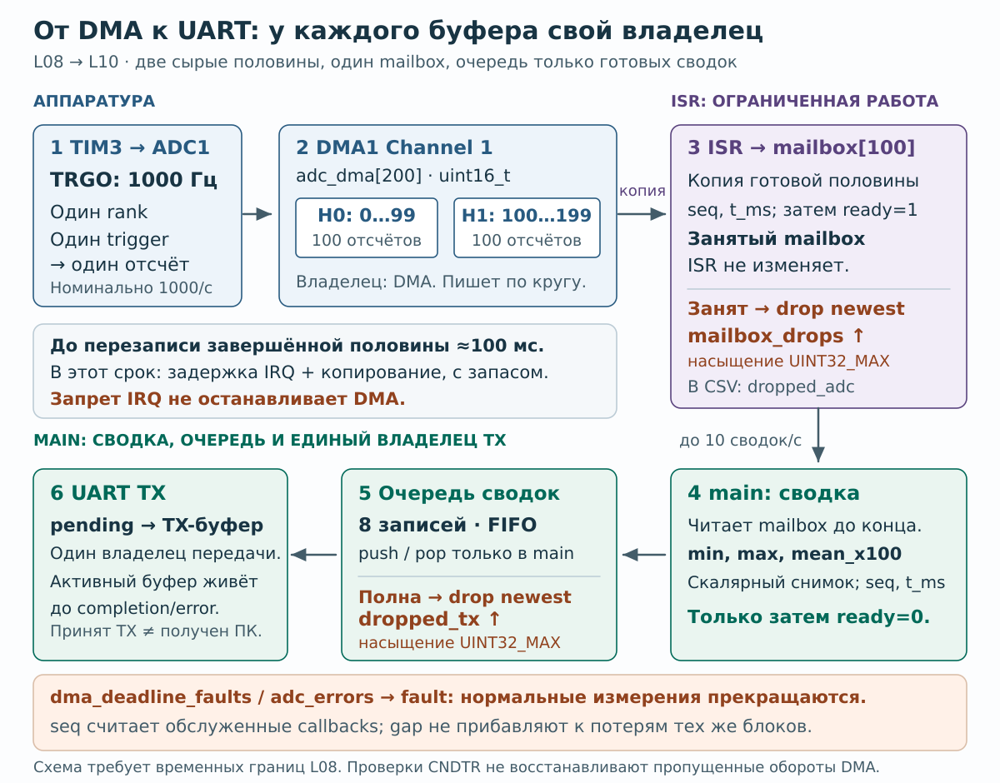

# L10. Буферы, протокол и хранение: данные переживают нагрузку

**Время:** около 4 часов.  
**Результат:** ограниченная очередь, проверяемый CSV-поток, понятная политика потерь и честный бюджет RAM/Flash. Сохранение на ПК достаточно; SD-карта не нужна.  
**До начала:** UART из [L04](04-uart-protocol.md), [L08](08-adc-dma.md), указатели, массивы и `sizeof`. L09 можно пройти независимо; он не блокирует эту работу.  
**Оборудование:** прежняя плата и USB-UART 3,3 В. Новые модули не нужны.

## 1. Миссия: объяснить пропавшие две секунды

Измерения идут, но отправка приостановлена на две секунды. После восстановления нужны целые записи в правильном порядке и объяснение потерь. Предскажи: поможет ли замена очереди 8→16, если потребитель **постоянно** медленнее producer? Чем этот отказ отличается от задержки всего main в L08?

Перед кодом нарисуй DMA → mailbox → статистика → очередь записей → UART → файл ПК. Для первой версии **очередь записей обслуживает только main**; ISR работает по контракту L08. На рисунке раздели три разных хранилища: сырые samples, готовые records и активный TX-буфер.

Если ты уже писал кольцевые очереди, реализуй интерфейс и пройди тесты без подсказок, затем сразу проверь аппаратную перегрузку §6 и перенос §10. Успешный старый AVR-проект не заменяет проверки срока жизни DMA/TX-буфера здесь.

## 2. Теория на 10 минут

Буфер сглаживает временный всплеск, но не исправляет постоянно меньшую пропускную способность потребителя. Если приходит 20 записей/с, а уходит 10, конечная очередь рано или поздно заполнится. Увеличение её размера лишь отложит момент и увеличит задержку.

Выбери политику заранее:

- **Drop newest:** сохранить старую очередь, отклонить новую запись, увеличить счётчик
- **Drop oldest:** выбросить самую старую; полезно для свежего индикатора, но история теряется
- **Остановка измерения:** если полнота важнее непрерывности; остановку нужно показать пользователю

В этой работе — drop newest. Не блокируй ISR ожиданием свободного места. Не делай «безразмерный» `malloc` на каждый отсчёт.

## 3. Первый подход: чистый C без платы

Открой [учебный каркас](../../examples/host-buffering/README.md). Основной маршрут содержит интерфейсы и TODO для своей реализации; отдельный opt-in oracle открывай только после попытки. Сборка начального каркаса должна проходить; тесты до заполнения TODO намеренно красные.

```sh
cd examples/host-buffering
make build
make test-list
./build/test_stream initial_empty
```

### Задания по 15–20 минут

1. На бумаге прогони очередь ёмкостью 2. Начало разобрано: empty `(head=0, tail=0, count=0)` → push A `(1,0,1)` → push B `(0,0,2)`. Сам продолжи: failed push C → pop A → push D → pop B → pop D. Почему равенство head==tail само по себе не различает full и empty?
2. Реализуй init и empty pop. Запусти `initial_empty`.
3. Реализуй push/pop и инварианты `head < capacity`, `tail < capacity`, `count <= capacity`. Пустое чтение не меняет output, отказ push не перезаписывает очередь.
4. Реализуй насыщение `rejected` на UINT32_MAX. Это счётчик диагностических потерь; его переполнение не должно превращать большую проблему в ноль.
5. Проверь заполнение, переход через конец, многократные циклы и точный FIFO-порядок.
6. Добавь собственный регрессионный тест прежде, чем исправлять найденный дефект. Например, после успешного push затри исходный record: сохранённая запись должна остаться прежней.

<details>
<summary>Сверить свою трассу, не открывая реализацию</summary>

Failed push C: `(0,0,2)`, rejected=1. Pop A: `(0,1,1)`. Push D: `(1,1,2)`. Pop B: `(1,0,1)`. Pop D: `(1,1,0)`. Выданы A, B, D; C не заменяет ни A, ни B. При ошибке найди первый неверный переход, а не переписывай сразу весь модуль.

</details>

```sh
make check
make sanitize
```

Последний шаг зависит от поддержки sanitizer твоим host-компилятором. Он полезен, но не подтверждает корректность ISR/DMA или отсутствие всех ошибок. Код очереди без отдельно спроектированной синхронизации нельзя перенести в два контекста «просто добавив volatile».

**Контрольная точка 60–90 минут:** все тесты очереди проходят на твоей реализации; ты умеешь руками объяснить каждый переход wraparound. Протокол может пока оставаться незавершённым.

## 4. Второй подход: одна запись и границы кадра

Общий формат сводки для итогового устройства:

```text
seq,t_ms,n,min,max,mean_x100,freq_mHz,signal_valid,dropped_adc,dropped_tx
```

- `seq`: номер обслуженного ADC half-block, включая блоки, отвергнутые mailbox; не номер успешно отправленной строки
- `t_ms`: время фиксации готового блока; явно укажи, что это время наблюдения callback, а не точная отметка aperture первого sample
- `n`: количество samples в сводке, здесь 100
- `min`, `max`: raw ADC code; `mean_x100`: средний raw ×100, целое число
- `freq_mHz`: частота из предыдущей работы по input capture; если её ещё не интегрировал, 0
- `signal_valid`: 1 только если измерение частоты действительно актуально; иначе 0, и тогда `freq_mHz` **обязательно 0**, без старой частоты. Это не флаг успешности всей строки и не замена отдельному ADC fault
- `dropped_adc`: известные отклонения ADC mailbox/очереди; не выдуманное число событий, пропущенных за долгий запрет IRQ
- `dropped_tx`: накопленные отклонения очереди передачи/принятая политика неуспешной отправки

При нарушении дедлайна DMA прекращай выдачу нормальных измерений и переходи в отдельное состояние fault, как в L08. Значения `signal_valid=0` недостаточно, чтобы обозначить недостоверный ADC.

Пример **формата, не снятое измерение**:

```text
1,100,100,0,4095,204750,1000000,1,0,0
```

В реальном UART заканчивай каждую запись CRLF. Отправляй ровно длину строки без завершающего NUL. Перед CSV-заголовком передай `# session=<id>`; дополнительные строки с `#` содержат build ID, reset reason, nominal clock, sample rate, формат и измеренное/неизвестное VDDA. Только явный `# session=...` или повторный точный header начинает новую сессию. Произвольный `# status ...` не сбрасывает sequence/drop checks. Иначе комментарий способен скрыть ошибку, а reset с `seq=1` выглядит как обратный скачок.

### Форматирование и ошибки

Реализуй `stream_format_csv` из host-каркаса. Используй ограниченное форматирование, проверяй отрицательный результат и результат `>= capacity`; усечённую строку нельзя отправлять как полноценный кадр. Для `uint32_t` в переносимом C используй `<inttypes.h>` и `PRIu32`, а не предположение, что `unsigned long` везде 32-битный.

Worst case для десяти uint32_t: 100 десятичных цифр + 9 запятых + CRLF = 111 байт; ещё один нужен для NUL. Поэтому рабочий `char tx[128]` покрывает контракт. Это не разрешение произвольно расширять поля и забывать расчёт.

Для `n=100` сумма raw максимум 409500; вычисление `sum ×100` помещается в `uint32_t`. При произвольном размере блока перепроверь переполнение либо применяй достаточный тип. Fixed-point не означает, что ADC измеряет сотые доли LSB: дополнительные цифры описывают среднее.

Тесты должны проверить точную строку, граничную ёмкость, нулевую ёмкость, защитные байты вокруг маленького буфера и максимальные uint32_t. Порядок байтов структуры в RAM не определяет CSV; не отправляй `sizeof(struct)` как переносимый бинарный протокол.

## 5. Интеграция в CubeMX-проект

Конфигурация периферии остаётся L08: PA0, ADC1 по TIM3 1 кГц, DMA halfword circular, 100 samples в половине. USART1 PA9/PA10 — **115200 8N1**, оба конца явно настроены одинаково. PA13/14 остаются SWD.



`ready` сохраняет отдельную копию, пока main читает её; DMA-кольцо продолжает работать. Время до перезаписи половины включает ожидание IRQ и копирование. В очереди main лежат готовые сводки, а не сырые ADC-блоки.

[Открыть схему отдельно для увеличения](../assets/diagrams/adc-dma-mailbox-ownership.svg).

1. Скопируй свой чистый C-модуль в `Core/Src`, заголовок в `Core/Inc`; убедись, что сборка действительно включает новый `.c`.
2. В `USER CODE BEGIN 2` инициализируй очередь. В L10 ещё нет команды START: запуск после reset автоматический. Порядок старта ADC/DMA и TIM3 из L08 перенеси **после boot-вывода**: в стартовой фазе main единый владелец TX из пункта 5 передаёт сначала CRLF, затем `# session=...`, остальные metadata и точный CSV header по очереди. Начальный CRLF отделяет новую сессию даже от строки, оборванной reset. Дождись завершения последней передачи header с ограничением времени, затем запусти ADC/DMA и TIM3. До этого acquisition выключен; при ошибке boot-вывода не запускай поток молча. Это только порядок инициализации, новые команды протокола не нужны.
3. Добавь в mailbox поле `t_ms`, записываемое callback рядом с sequence до публикации ready. В `main` извлеки независимый mailbox, быстро вычисли min/max/mean, сохрани sequence и эту метку; затем освободи mailbox. Если вместо этого ставишь время в main, назови его временем обработки, а не готовности блока.
4. Создай запись в очереди. При отказе увеличь/сохрани `dropped_tx`; значение будет видно в следующей принятой записи.
5. Выбери **одного владельца TX**. При интеграции `uart_console.c` из L04 все отправки делай через него: в main вызывай `uart_console_poll()`, проверяй `uart_console_tx_idle()`, затем используй `uart_console_reply(csv_line)`. Не добавляй параллельные прямые `HAL_UART_Transmit*` за спиной этого модуля.
6. После извлечения записи сохрани её/строку в отдельном pending-слоте до подтверждённого принятия владельцем TX. Если `uart_console_reply` вернул false, запись ещё не считается отправленной: сохрани её, диагностируй отказ и повторяй только по ограниченной политике/backoff. Успешный возврат означает принятие в стабильный внутренний буфер, а не получение на ПК. Счётчик `tx_dropped` самого console описывает отвергнутые попытки вызова; не приравнивай каждую попытку к потерянному CSV record, если его позднее отправили.
7. Все старты TX и решения о повторе остаются в main. У ISR только callbacks состояния; между idle-check и start другой код не должен начинать передачу. Командные ответы, metadata и CSV проходят через одного диспетчера. Неизвестно долгое busy требует ограниченной диагностики, не вечного ожидания.
8. При ошибке уже начатой передачи часть строки могла уйти. Не повторяй её вслепую: получишь склейку/дубликат. Для учебной политики можно объявить кадр потерянным, после восстановления отправить разделитель CRLF и продолжить новым sequence; receiver отвергает неполные/неверные строки.

**Отдельный упрощённый вариант без console-модуля:** если единственный TX в проекте — твой main, допустим blocking `HAL_UART_Transmit` с ограниченным timeout, например 30 мс. Этот вариант не смешивается с `Transmit_IT`-ответами L04 без нового единого диспетчера. Обслуживание кнопок/команд и временной бюджет всё равно проверяются.

При 115200 8N1 предел линии около 11520 байт/с. Даже worst-case 111 байт ×10 Гц = 1110 байт/с. Одна такая строка занимает минимум около 9,64 мс на линии; накладные расходы измерь. Вызов с timeout 30 мс не доказывает, что приложение всегда уложится в него при неработающем SysTick или запрещённых IRQ.

### Если добавишь свой UART DMA/IT вместо console

L04 console уже содержит IT-передачу со стабильным буфером. Следующие правила относятся к замене его владельца TX своей реализацией, а не к запуску второго параллельного передатчика:

- `HAL_UART_Transmit_DMA` не копирует весь твой буфер в тайный надёжный storage
- TX-буфер должен существовать и не изменяться до completion/error
- Один стабильный `tx_active[128]` + флаг состояния проще, чем указатель на локальный массив
- `HAL_BUSY` — повод сохранить очередь и попробовать позже, не молча потерять запись
- Completion/Error callbacks лишь меняют состояние; форматирование и политика повторов остаются в main
- Возвращать slot в очередь можно только после окончания владения UART, либо сразу после копирования в отдельный `tx_active`

Не вводи DMA для UART только ради слова DMA: сначала измерь, чего не хватает первой версии. При переходе на свой модуль удаляй конфликтующее владение/duplicate callbacks и повторяй тесты recovery.

## 6. Намеренная перегрузка, которая действительно проверяет очередь

**Плохой тест:** закрыть окно терминала и ожидать `HAL_BUSY`. Без аппаратного flow control передатчик не знает, читает ли ПК данные.

**Хороший тест:** на 2 секунды запрети **выгрузку TX-очереди в main**, но продолжай принимать mailbox и класть сводки. Не используй для этого `HAL_Delay(2000)`, иначе перестанет работать сам producer сводок. Используй неблокирующее условие по времени/флагу. ADC IRQ остаются разрешены.

Для capacity=8 и rate=10 записей/с запас — примерно 0,8 с. Прежде чем смотреть фактический счётчик, реши точное условие: очередь пуста, pending-слот не используется, в период запрета сделано **20 попыток push с seq=1…20**, pop не было. Какие seq сохранятся, сколько отклонено, чему равен high-water mark?

<details>
<summary>Подсказка без ответа</summary>

Запрет касается выгрузки, поэтому main всё ещё должен обрабатывать каждый mailbox. Места не освобождаются. Отказ push не заменяет старую запись; sequence producer всё равно продвигается.

</details>

<details>
<summary>Обратная связь и переход к реальному окну</summary>

Приняты первые 8, следующие 12 отклонены, high-water=8. После их выгрузки следующий принятый seq=21 покажет gap=12. Для начальной занятости q и k попыток при полном запрете pop добавится `max(0, q+k−8)` отказов. Это условный расчёт; реальные две секунды могут пересечь другую границу блока. Запиши начальную занятость и фактическое k, а не подгоняй счётчик под 12. Если во время паузы разрешён pop в отдельный pending, свободных мест уже другая величина — отрази это в модели.

</details>

После разрешения отправки:

- FIFO-порядок оставшихся записей сохраняется
- Нет повреждённых или склеенных строк
- Sequence показывает пропуски, `dropped_tx` объясняет известную часть потерь
- Очередь возвращается к обычной занятости; максимальная занятость сохранена
- Если растёт `dropped_adc`, отдельно исследуй время обработки/UART, а не называй это той же ошибкой

Важная проверка наблюдаемости: старые записи в очереди несут **старый снимок** dropped_tx. Дождись хотя бы одной новой принятой записи после перегрузки и её передачи; иначе файл может закончиться до появления нового счётчика и gap. Из одного такого обрезанного файла нельзя заключить «потерь не было».

Для дополнительной поломки убери modulo/wrap в своей host-очереди и убедись, что тесты/санитайзер обнаруживают дефект. На плату такой вариант не загружать.

## 7. Бюджет памяти и времени

Для STM32F103C8 проектируем под **64 КБ Flash и 20 КБ SRAM**. Не рассчитывай на «скрытые 128 КБ» конкретной Blue Pill. Объём целевого устройства уточняется по [даташиту](https://www.st.com/resource/en/datasheet/stm32f103c8.pdf), а фактический расход — по linker map/`arm-none-eabi-size`.

Учебный стартовый бюджет статических массивов:

| Объект | Расчёт |
|---|---|
| ADC DMA | 200 ×2 = 400 байт |
| Один mailbox | 100 ×2 = 200 байт |
| Очередь из 8 сводок | 8 ×40 = 320 байт самих данных; индексы/счётчики отдельно |
| Стабильный TX | 128 байт |
| RX command buffer, если нужен | например 64 байта |
| HAL handles, globals, stack, heap | измерить отдельно; не считать нулём |

`sizeof` на host может отличаться: `size_t` часто 64-битный. Проверяй целевую структуру и alignment. 64-битное время/деление, `printf` с float и библиотеки могут заметно увеличить Flash/stack; Cortex-M3 не имеет аппаратного FPU. Не включай float-formatting без потребности.

Минимальные значения stack/heap в linker script не являются измерением максимального stack. Для итоговой сборки сохрани map, выбранный резерв и результат анализа/измерения stack под нагрузкой. Не занимай всю свободную SRAM массивом только потому, что linker пока разрешает.

Задачи:

1. Raw 1 кГц ×2 байта = 2000 байт/с. Посчитай память на 3 с и на минуту; сравни с доступным остатком, не с полными 20 КБ.
2. Сводки 40 байт ×10 Гц = 400 байт/с в RAM до служебных полей. Сравни с CSV на линии и на диске.
3. Посчитай допустимую задержку consumer для queue=8 и 16; объясни, почему средняя пропускная способность от этого не выросла.
4. Назови самое длинное блокирующее действие и докажи, что оно не срывает дедлайн ADC.

## 8. Хранение: сначала ПК, потом необязательная автономность

Основной маршрут — UART → сохранение реального CSV на ПК. Пользуйся raw/text-логированием терминала без добавленных timestamps; отдельный serial logger не обязателен. Не подменяй аппаратный лог синтетическими строками; для тестовых файлов явно помечай происхождение.

Проверки файла:

- У каждой data-строки 10 полей; числа парсятся и входят в допустимые диапазоны
- `n=100`, `0 <= min <= max <= 4095`, среднее между min/max с учётом fixed-point
- Sequence и счётчики анализируются внутри одной boot/session
- Пропуски, дубликаты, повреждённые/неполные строки и reset считаются отдельно
- Сопоставь журнал с физическим действием: поворот потенциометра или безопасная смена PA0 между GND/3V3 при выключенном питании

Проверь файл [готовым checker](../../tools/README-capture.md):

```sh
python3 tools/check_capture.py evidence/run.csv
python3 tools/check_capture.py evidence/normal-run.csv --require-no-loss --min-rows 600 --min-device-span-ms 59000 --expected-period-ms 100 --period-tolerance-ms 5
```

Для нормального опыта сначала открой текстовый capture в терминале, затем нажми Reset платы, оставив USB-UART подключённым и логирование включённым. Firmware передаёт новые metadata/header и автоматически запускает acquisition в порядке §5; создавать header вручную после записи нельзя.

Через не менее 65 с по часам ПК останови **логирование на ПК**. Acquisition на плате продолжает работать: команды STOP в L10 ещё нет, опустошение очереди здесь не заявляется. Сохрани исходный файл. Для проверки при необходимости сделай отдельную копию записанного интервала от metadata/header нового boot до последней полной строки с LF. Исключать разрешается только фрагмент прошлого потока до этой сессии и незавершённый хвост без LF; повреждённые завершённые строки не удаляй. Запиши границы обрезки и первый/последний seq. Проверка относится только к этому интервалу; полнота данных после него не подтверждена.

Если команды L12 уже реализованы, вместо reset можно использовать предусмотренный там новый START из IDLE. Порог 600 строк и 59 000 мс проверяется **в каждой** сессии; 600 записей с интервалом 100 мс имеют span 59 900 мс между первой и последней, а не 60 000. Нельзя склеить несколько коротких запусков ради минутного gate.

Для перегрузочного опыта первый вариант допускает зафиксированные потери; второй предназначен для нормального режима. Cadence проверяется по меткам callback и seq, с учётом gaps; 5 мс — учебный допуск разброса меток, не характеристика HSI. Эти числа не являются независимым измерением sampling rate. Команды выполняются из корня репозитория. Проверки самого checker: `python3 -m unittest discover -s tests -p 'test_capture_checker.py' -v`; все их данные синтетические и не заменяют аппаратный gate. Прохождение файла не доказывает его аппаратное происхождение.

До запуска checker ответь: «пройдёт ли одна корректная строка без дополнительных флагов и что это докажет?»

<details>
<summary>Проверить ответ и границы автоматической проверки</summary>

Да — по формату, но это ещё не длительный опыт. Скрипт не знает о строках, потерянных до первого/после последнего seq, и не трактует свободный текст `# fault` как аппаратный диагноз. Просмотри границы capture и fault/status вместе с результатом проверок. Печать на UART не подтверждает запись на диск: заверши capture, прочитай сохранённый файл заново.

</details>

### Внутренняя Flash: только отдельное расширение для настроек

Она не является бесконечным EEPROM и не подходит для наивной записи каждого sample. У C8 medium-density стирание идёт страницами; нужно учитывать ограниченный ресурс циклов, время erase/program, выравнивание и ограничения выполнения кода при занятости Flash. Изучи [PM0075](https://www.st.com/resource/en/programming_manual/pm0075-stm32f10xxx-flash-memory-microcontrollers-stmicroelectronics.pdf) и таблицу endurance своего даташита.

До любого кода записи требуется план:

1. Явно зарезервировать страницы в linker script и проверить map, чтобы не стереть прошивку
2. Сначала остановить acquisition и trigger, завершить передачу и перейти в режим сохранения настроек; не писать/стирать Flash из ADC ISR и не обещать бесшовную запись одновременно с жёстким sampling deadline
3. Две копии/журнал: version, length, sequence, CRC и признак завершённой записи; новая версия становится активной только после проверки
4. Ограничить частоту записи, например только по явной команде SAVE; не сохранять при каждом изменении ручки
5. Проверить восстановление при прерывании операции на безопасной учебной плате, не затрагивая option bytes, защиту и загрузчик

В базовой работе Flash не пишется. SD/FRAM/внешняя EEPROM — будущие проекты: им тоже нужны уровни питания, протокол, задержки, ресурс и recovery. SPI loopback из L09 ещё не доказывает готовность драйвера SD.

## 9. Gate и доказательства

В `evidence/L10.md`:

- Твоя реализация host-очереди и форматтера; шесть тестов проходят, sanitizer-статус записан честно
- Инварианты и выбранная политика overflow
- RAM/Flash из **целевой** сборки; отдельно статическая память и резерв stack
- Нормальный аппаратный лог не менее минуты и лог с двухсекундной паузой TX
- Предсказанные и фактические sequence gaps/rejected/high-water; один журнал «условие → прогноз → наблюдение → вывод» покрывает нормальный и перегрузочный режимы
- Одна намеренная ошибка, тест до исправления и исправление
- Какие потери устройство обнаруживает, а какие без подтверждений от ПК обнаружить не может

Без платы можно закрыть только host-часть. Без аппаратного лога состояние этой работы «host проверен, интеграция не проверена», а не «устройство готово».

## 10. Воспроизведение и перенос без AI

По пустым интерфейсам восстанови очередь из памяти, проверь wrap и full/empty. Потом измени требование: индикатор должен показывать **самое свежее** значение. Сам выбери другую политику, измени тесты до кода и объясни, почему старый gate drop-newest больше не подходит.

Незнакомый перенос: в сутки нужно сохранить 10 минут события с 2 каналами по 1 кГц. Рассчитай raw-объём, пики записи и задержку; предложи архитектуру хранения с пометкой, какие параметры внешнего накопителя нужно измерить. Не выбирай SD только потому, что встретил её в примере.

AI-подсказка:

> Вот последовательность push/pop, ожидаемые head/tail и падающий тест. Не пиши очередь целиком. Найди первый шаг, где мой инвариант нарушается, и задай вопрос, который поможет мне самому исправить условие.

AI-review:

> Проверь мой модуль и аппаратный лог на переполнение, усечение CSV, порядок FIFO, срок жизни UART-буфера и смешение ISR/main. Для каждого риска предложи один тест. Не считай host-тест доказательством работы DMA и не придумывай аппаратные результаты.

[Источники и границы редакционной проверки](../reference/ADC_DMA_BUSES.md).
